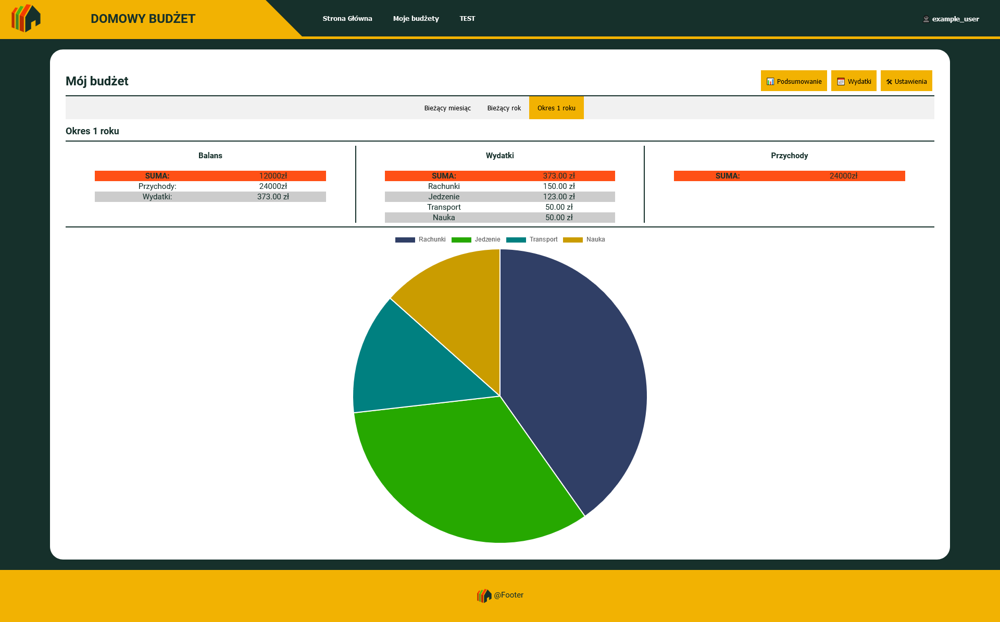

<a name="readme-top"></a>
<!-- PROJECT LOGO -->
<br />
<div align="center">
  <a href="https://github.com/Quasit/home_budget_app">
    
  </a>

  <h3 align="center">Home budget app</h3>

  <p align="center">
    Flask app project for home budget management.
  </p>
</div>

<!-- TABLE OF CONTENTS -->
<details>
  <summary>Table of Contents</summary>
  <ol>
    <li>
      <a href="#about-the-project">About The Project</a>
      <ul>
        <li><a href="#built-with">Built With</a></li>
      </ul>
    </li>
    <li>
      <a href="#installation">Installation</a>
      <ul>
        <li><a href="#locally">Locally</a></li>
      </ul>
      <ul>
        <li><a href="#docker">Docker</a></li>
      </ul>
      <ul>
        <li><a href="#kubernetes">Kubernetes</a></li>
      </ul>
    </li>
    <li><a href="#features">Features</a></li>
    <li><a href="#roadmap">Roadmap</a></li>
    <li><a href="#license">License</a></li>
    <li><a href="#contact">Contact</a></li>
    <li><a href="#acknowledgments">Acknowledgments</a></li>
  </ol>
</details>

<!-- ABOUT THE PROJECT -->
## About The Project



This is my personal project to develop my coding skills around Flask framework.

Project is still under development

The main idea was to build web app for management home budget with more than 1 person.
The app's main use is to add all expenses and incomes made by all persons included in budget, but also check which person is using those expenses.
For example when there is 2 people in house and one buys dinner, but both of them are using it. But the other time one of those persons buys ice cream and eats it alone.
And this app is meant to allow to check who is using how much from money spent and how much money is spent compared to income.
Those are just few basic examples of what that app would be used for.

<p align="right">(<a href="#readme-top">back to top</a>)</p>


### Built With

Below are major frameworks/libraries that I used to build that project 

* Python 3
* Flask
* Jinja2 templates (HTML)
* SQLAlchemy
* SQLite
* Javascript
* Pytest
* Docker
* Kubernetes


<p align="right">(<a href="#readme-top">back to top</a>)</p>


<!-- Installation -->
## Installation

### Docker
To run application using docker containers follow below steps
1. Clone the repo
   ```sh
   git clone https://github.com/Quasit/home_budget_app.git
   ```
2. Compose docker containers
    ```docker
    docker compose up -d
    ```
3. App is available in your browser at <a href="http://127.0.0.1:5000/">http://127.0.0.1:5000/</a>
   
4. When you will want to stop application use docker compose down
    ```docker
    docker compose down
    ```

### Locally
To run application locally follow below steps

1. Clone the repo
   ```sh
   git clone https://github.com/Quasit/home_budget_app.git
   ```
2. Create venv
    ```sh
    python -m venv .venv
    ```
4. Activate venv with powershell
    ```sh
    .\.venv\Scripts\Activate.ps1
    ```
5. Install requirements
   ```sh
   pip install -r requirements.txt
   ```
6. Create `config.py` in /script folder and fill it up as below:
   ```python
    class DevelopmentConfig():
        TESTING = False
        SQLALCHEMY_TRACK_MODIFICATIONS = False
        SECRET_KEY = 'ENTER YOUR SECRET KEY'
        SQLALCHEMY_DATABASE_URI = 'sqlite:///../data/budget_database.db'
   ```
7. Run app in using app_run.py file:
   ```sh
   python3 app_run.py
   ```
8. App is available in your browser at <a href="http://127.0.0.1:5000/">http://127.0.0.1:5000/</a>


### Kubernetes
If you have installed Minikube check <a href="/kubernetes/README.md">Kubernetes README</a> for details

<p align="right">(<a href="#readme-top">back to top</a>)</p>


<!-- IMPLEMENTED FEATURES -->
## FEATURES

Below are listed features that I have already implemented in the project

* User Registering and Logging
* CRUD and Database models
* Data forms with input validation
* Special input types in forms
  * Date with Calendar popup
  * Color with Color Picker
* Data visualization in charts
* Unit Tests


<p align="right">(<a href="#readme-top">back to top</a>)</p>


<!-- ROADMAP -->
## Roadmap

- [x] Base templates
- [x] SQLite database and SQLAlchemy Models
- [x] User register and login system and pages
- [x] Basic Budget pages
- [x] Basic Expenses pages
- [ ] Basic Income pages
- [x] Expenses and income list in table page
- [x] Pagination in Expenses and Income table page
- [ ] Filters in Expenses and Income table page
- [x] Summary view for basic periods (current month / current year / one year period)
- [ ] Summary view for dates selected by user
- [x] Basic chart in budget summary page
- [ ] Page with additional charts
- [x] Color picker for Expenses Categories
- [ ] Adding other Users to Budgets in Budget settings page
- [x] Pytest fixtures and test database prep
- [x] Unit tests for app and database setup
- [x] Unit tests for functions
- [x] Unit tests for routes
- [x] Dockerfile setup
- [x] docker-compose setup
- [x] Kubernetes configuration files


<p align="right">(<a href="#readme-top">back to top</a>)</p>


<!-- LICENSE -->
## License

Distributed under the MIT License. See `LICENSE.txt` for more information.


<p align="right">(<a href="#readme-top">back to top</a>)</p>


<!-- CONTACT -->
## Contact

Email - waltermichal92@gmail.com

Project Link: [Home Budget App](https://github.com/Quasit/home_budget_app)


<p align="right">(<a href="#readme-top">back to top</a>)</p>


<!-- ACKNOWLEDGMENTS -->
## Acknowledgments

I would like to give credit to scripts, that I used to make my project better.

* [Chart.js](https://www.chartjs.org/)
* [w3schools](https://www.w3schools.com/)


<p align="right">(<a href="#readme-top">back to top</a>)</p>